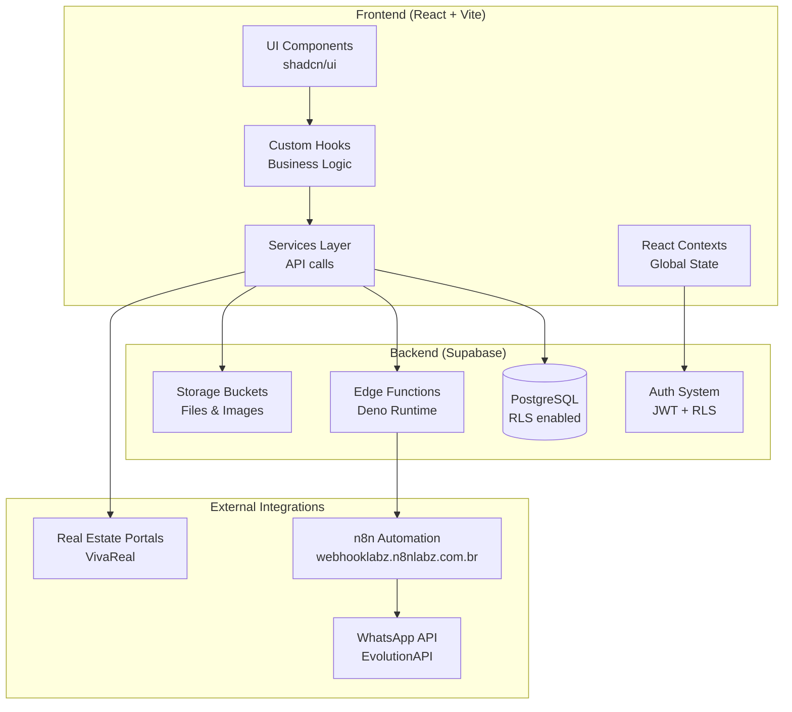
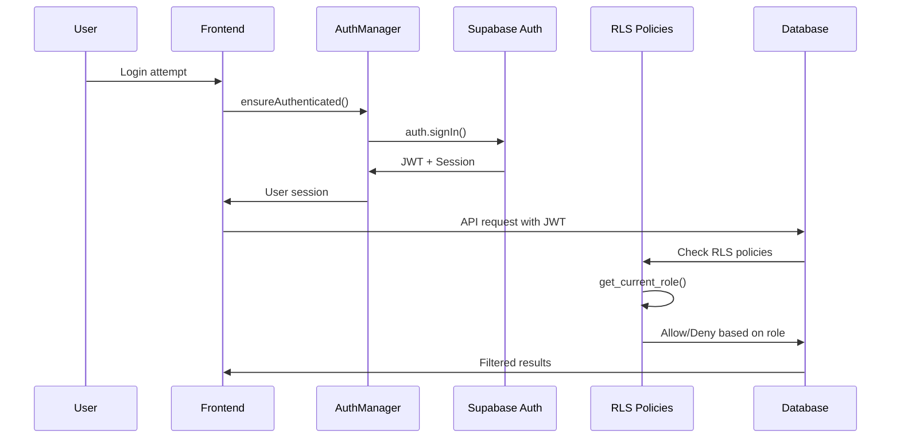
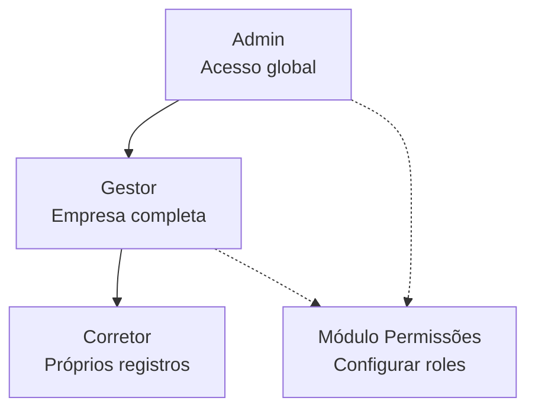

# 🏢 IMOBIPRO Dashboard — Global Rules & Architecture Guide

## Índice
1. [Visão Geral & Objetivo do Projeto](#1-visão-geral--objetivo-do-projeto)
2. [Stack & Módulos](#2-stack--módulos)
3. [Arquitetura](#3-arquitetura)
4. [Modelagem de Dados](#4-modelagem-de-dados)
5. [Autenticação & Autorização](#5-autenticação--autorização)
6. [Integrações Externas](#6-integrações-externas)
7. [Qualidade & DX](#7-qualidade--dx)
8. [Segurança & LGPD](#8-segurança--lgpd)
9. [CI/CD & Ambientes](#9-cicd--ambientes)
10. [Padrões de Contribuição](#10-padrões-de-contribuição)
11. [Definição de Pronto (DoD)](#11-definição-de-pronto-dod)
12. [MVP: Escopo e Limites](#12-mvp-escopo-e-limites)
13. [Roteiro de Onboarding](#13-roteiro-de-onboarding)
14. [Apêndice de Evidências](#14-apêndice-de-evidências)

---

## 1. Visão Geral & Objetivo do Projeto

**ImobiPRO Dashboard** é uma solução SaaS para gestão de imobiliárias que permite:
- Gerenciamento de propriedades e leads
- Sistema de chat integrado com WhatsApp
- Dashboard com métricas e relatórios
- Gestão de contratos e templates
- Automações via n8n
- Sistema de permissões hierárquico

### 1.1 Princípios Fundamentais (Obrigatórios)

1. **Segurança por padrão** — RLS ativo em todas as tabelas de domínio. Não publicar features sem testes de RLS.
2. **Fonte única de verdade** — migrations SQL em `supabase/migrations/` são o SSOT do schema.
3. **Nomenclatura consistente** — DB em snake_case, aplicação em camelCase com mapper centralizado.
4. **Segredos seguros** — SUPABASE_SERVICE_ROLE, N8N_WEBHOOK_SECRET, JWT_SECRET só em server/edge environment.

## 2. Stack & Módulos

### 2.1 Frontend
- **Framework**: React 18.3.1 + TypeScript 5.5.3
- **Bundler**: Vite 5.4.1 com SWC
- **UI Library**: Tailwind CSS + shadcn/ui (Radix UI)
- **Charts**: MUI X-Charts + Recharts
- **Forms**: React Hook Form + Zod validation
- **Routing**: React Router DOM
- **Estado**: Context API + Custom Hooks

*Evidências: package.json:67-80, vite.config.ts:1-67*

### 2.2 Backend & Database
- **Backend**: Supabase PostgreSQL + Edge Functions (Deno)
- **Auth**: Supabase Auth com RLS
- **Storage**: Supabase Storage (buckets: property-images, contract-templates)
- **Real-time**: Supabase Realtime para notificações

*Evidências: supabase/config.toml:1, src/integrations/supabase/client.ts:17-29*

### 2.3 Integrações & Automações
- **n8n**: Automação de workflows (webhooklabz.n8nlabz.com.br)
- **WhatsApp**: EvolutionAPI integration
- **PDFs**: jspdf, react-pdf, mammoth para documentos
- **Exportação**: HTML2Canvas, HTML2PDF para relatórios

*Evidências: vite.config.ts:12-22, src/services/whatsappWebhook.ts:1-30*

### 2.4 Estrutura de Módulos

```
src/
├── components/          # Componentes React organizados por funcionalidade
│   ├── ui/             # shadcn/ui components base
│   ├── dispatch/       # Módulo de automação/disparador  
│   └── [feature]/      # Componentes específicos por feature
├── hooks/              # Custom hooks para lógica de negócio
├── services/           # Camada de serviços (metrics, webhooks)
├── integrations/       # Integrações externas (supabase)
├── lib/                # Utilitários (charts, permissions, utils)
├── contexts/           # React Contexts
├── pages/              # Páginas principais da aplicação
└── types/              # Definições TypeScript
```

*Evidências: estrutura de pastas levantada via LS*

---

## 3. Arquitetura

### 3.1 Estilo Arquitetural
- **Frontend**: Component-Based Architecture com Custom Hooks
- **Backend**: Serverless Functions + Database-as-a-Service  
- **Integração**: Event-Driven com webhooks
- **Deploy**: Static Site + Edge Functions

*Evidências: src/pages/Index.tsx:1-50, src/hooks/useAuthManager.ts:6-40*

### 3.2 Diagramas da Arquitetura

#### Visão de Módulos


#### Fluxo de Autenticação e Autorização


#### Data Flow - Lead Management
```mermaid
flowchart LR
    subgraph "Lead Creation Flow"
        A[User creates lead] --> B{Permission Check}
        B -->|Admin/Gestor| C[Create anywhere]
        B -->|Corretor| D[Create with user_id = auth.uid()]
        C --> E[(Database)]
        D --> E
    end
    
    subgraph "WhatsApp Integration"
        E --> F[Lead created event]
        F --> G[n8n webhook]
        G --> H[WhatsApp message]
        H --> I[Update chat record]
        I --> E
    end
```

*Evidências: src/hooks/useAuthManager.ts:20-40, src/lib/permissions/rules.ts:8-12, docs/schema-db-imobipro.md:70-77*

---

## 4. Modelagem de Dados

### 4.1 Visão Geral
O banco segue modelo **role-based** com RLS ativo. Referência completa: `docs/schema-db-imobipro.md`

### 4.2 Tabelas Principais

#### user_profiles
- **PK**: `id (uuid)` - espelha auth.users.id
- **RLS**: próprio registro apenas (`id = auth.uid()`)
- **Campos**: email, full_name, role, phone, avatar_url, is_active

#### properties 
- **PK**: `id (text)`
- **RLS**: Admin/Gestor (CRUD), Corretor (read + disponibilidade only)
- **Campos**: title, type, price, area, bedrooms, disponibilidade, user_id

#### leads
- **PK**: `id (uuid)`  
- **RLS**: Admin/Gestor (todos), Corretor (próprios apenas)
- **Campos**: name, email, phone, source, property_id, stage, user_id

### 4.3 Hierarquia de Papéis


*Evidências: docs/schema-db-imobipro.md:30-141, src/lib/permissions/rules.ts:8-15*

---

## 5. Autenticação & Autorização

### 5.1 Sistema de Auth
- **Supabase Auth**: JWT + Session management  
- **AuthManager**: Singleton para gerenciamento centralizado
- **RLS**: Row Level Security baseado em roles
- **Função**: `get_current_role()` para determinar role efetiva

*Evidências: src/hooks/useAuthManager.ts:6-40, docs/schema-db-imobipro.md:20-25*

### 5.2 Matriz de Permissões

| Tabela | Admin | Gestor | Corretor |
|--------|--------|--------|----------|
| user_profiles | Próprio registro | Próprio registro | Próprio registro |
| properties | CRUD global | CRUD global | Read + Disponibilidade |
| leads | CRUD global | CRUD global | CRUD próprios |
| contracts | CRUD global | CRUD global | Read próprios |
| imobipro_messages | CRUD global | CRUD global | Por instância¹ |
| whatsapp_instances | CRUD global | CRUD global | Negado |

*¹Corretor: instância `sdr` (acesso livre) + outras instâncias via `company_id`*

*Evidências: docs/hierarquia-usuarios.md, src/lib/permissions/rules.ts:7-12, supabase RLS policies*

### 5.3 Edge Functions para Admin
- **admin-create-user**: Criação de usuários
- **admin-delete-user**: Exclusão de usuários  
- **admin-update-user**: Atualização de usuários

*Evidências: supabase/functions/admin-create-user/index.ts:1-30*

---

## 6. Integrações Externas

### 6.1 n8n Automation Platform
- **Endpoint**: webhooklabz.n8nlabz.com.br
- **Proxy Vite**: `/api/webhook` → `/webhook`
- **Uso**: Automações WhatsApp, workflows de leads
- **Config**: vite.config.ts:12-22

### 6.2 WhatsApp via EvolutionAPI
- **Service**: src/services/whatsappWebhook.ts
- **Env**: VITE_EVOLUTION_API_URL
- **Fluxo**: Lead → n8n → WhatsApp → Database

### 6.3 Portais Imobiliários
- **VivaReal**: Tabela `imoveisvivareal`
- **Import/Sync**: Propriedades externas
- **Status**: Integração existente com disponibilidade

*Evidências: src/services/whatsappWebhook.ts:1-30, vite.config.ts:12-22*

---

## 7. Qualidade & DX

### 7.1 Linting e Formatação
- **ESLint 9**: TypeScript rules + React hooks
- **Config**: Permissiva para MVP (warnings > errors)
- **Scripts**: `pnpm lint`

*Evidências: eslint.config.js:1-46, package.json:10*

### 7.2 TypeScript
- **Versão**: 5.5.3
- **Config**: Modo permissivo (noImplicitAny: false)
- **Path mapping**: `@/*` → `./src/*`

*Evidências: tsconfig.json:7-18*

### 7.3 Build & Performance
- **Code splitting**: Lazy loading de componentes
- **Manual chunks**: PDFs, Canvas, domains
- **Otimizações**: Bundle size otimizado por feature

*Evidências: vite.config.ts:37-63, src/pages/Index.tsx:10-36*

### 7.4 Developer Experience
- **Hot reload**: Vite development server
- **Error boundaries**: Fallback components para lazy loading
- **Debug logs**: Console logs em desenvolvimento
- **Preview context**: Para testes de componentes

*Evidências: src/pages/Index.tsx:20-35, src/contexts/PreviewContext.tsx*

---

## 8. Segurança & LGPD

### 8.1 Segurança de Dados
- **RLS**: Row Level Security em todas as tabelas
- **JWT**: Tokens seguros com refresh automático
- **Secrets**: Environment variables (server-side only)
- **CORS**: Configurado para domínios específicos

### 8.2 Princípio do Menor Privilégio
- **Corretor**: Acesso limitado aos próprios dados
- **Gestor**: Acesso à empresa completa
- **Admin**: Acesso global limitado

### 8.3 LGPD & Retenção de Dados
- **Base legal**: Consentimento + interesse legítimo
- **Minimização**: Apenas dados necessários
- **Anonimização**: Logs sem dados pessoais
- **Auditoria**: Tabela audit_logs (planejada)

*Evidências: src/integrations/supabase/client.ts:5-12, docs/schema-db-imobipro.md:11-17*

---

## 9. CI/CD & Ambientes

### 9.1 Branching & Deploy
- **Branch ativa**: 23-08-25-Tiago  
- **Main branch**: main
- **Deploy**: GitHub Actions → Hostinger (estático)
- **Edge Functions**: Deploy via Supabase CLI

*Evidências: git status output, vite.config.ts:7-23*

### 9.2 Scripts Disponíveis
```json
{
  "dev": "vite",
  "build": "vite build", 
  "build:dev": "vite build --mode development",
  "lint": "eslint .",
  "preview": "vite preview"
}
```

*Evidências: package.json:6-11*

### 9.3 Ambientes
- **Development**: Local com Vite dev server
- **Production**: Build estático no Hostinger
- **Database**: Supabase (projeto: vitiqschibbontjwhiim)

---

## 10. Padrões de Contribuição

### 10.1 Commits
- **Idioma**: Português brasileiro
- **Padrão**: Conventional Commits recomendado
- **Formato**: `tipo: descrição curta e útil`

### 10.2 Code Review
- **RLS**: Testar políticas antes de merge
- **Lint**: `pnpm lint` deve passar
- **Build**: `pnpm build` deve ser bem-sucedido
- **Docs**: Atualizar progress_log.md
- **Docs Vivos**: Atualizar hierarquia-usuarios.md e/ou schema-db-imobipro.md se aplicável

### 10.3 Documentação Obrigatória
- **hierarquia-usuarios.md**: DEVE ser atualizado em qualquer mudança de RLS/permissões/acessos
- **schema-db-imobipro.md**: DEVE ser atualizado em qualquer migration/alteração no Supabase
- **Responsabilidade**: Desenvolvedor que faz a alteração DEVE atualizar a documentação
- **Verificação**: Code review DEVE validar se docs foram atualizados

### 10.4 Nomenclatura
- **Database**: snake_case (properties, user_profiles)  
- **TypeScript**: camelCase (userProfiles, propertyData)
- **Files**: kebab-case para componentes (UserManagementView.tsx)

---

## 11. Definição de Pronto (DoD)

### 11.1 Checklist de Feature
- [ ] Implementação funcional
- [ ] RLS policies aplicadas e testadas
- [ ] Lint passing (`pnpm lint`)  
- [ ] Build successful (`pnpm build`)
- [ ] Tipos TypeScript atualizados se necessário
- [ ] Documentação atualizada (progress_log.md)
- [ ] **Docs Vivos**: hierarquia-usuarios.md atualizado (se mudança RLS/permissões)
- [ ] **Docs Vivos**: schema-db-imobipro.md atualizado (se migration/mudança DB)

### 11.2 Checklist de PR/Merge  
- [ ] Migrations incluídas se alteração de schema
- [ ] Testes de RLS executados
- [ ] Edge functions deployadas se necessário
- [ ] **Docs Vivos validados**: hierarquia-usuarios.md e schema-db-imobipro.md checados
- [ ] Branch limpa e pronta para merge

---

## 12. MVP: Escopo e Limites

### 12.1 Módulos no MVP
✅ **Dashboard**: Métricas e gráficos básicos  
✅ **Propriedades**: CRUD + disponibilidade
✅ **Leads**: Gestão e pipeline  
✅ **Usuários**: Criação e permissões
✅ **WhatsApp**: Conversas básicas  
✅ **Contratos**: Templates e gestão
✅ **Agenda**: Calendário básico

### 12.2 Fora do MVP
❌ **Relatórios avançados**: Dashboards complexos
❌ **Integrações múltiplas**: Além de VivaReal/WhatsApp  
❌ **Multi-tenancy**: Sistema single-tenant por enquanto
❌ **Auditoria completa**: Logs detalhados de ações
❌ **Performance avançada**: Cache, CDN, otimizações

*Referência: Itens fora do MVP → docs/proximos-passos.md*

---

## 13. Roteiro de Onboarding

### 13.1 Pré-requisitos
- Node.js 18+ 
- pnpm (package manager)
- Acesso ao projeto Supabase (vitiqschibbontjwhiim)
- Variáveis de ambiente (.env.local)

### 13.2 Setup Local
```bash
# 1. Clone e instale dependências
git clone [repo-url]
cd dark-estate-dashboard  
pnpm install

# 2. Configure environment
cp .env.production .env.local
# Ajuste VITE_SUPABASE_URL e VITE_SUPABASE_ANON_KEY

# 3. Execute desenvolvimento
pnpm dev
# Acesse http://localhost:8081
```

### 13.3 Scripts Úteis
```bash
pnpm lint          # Verificar code quality
pnpm build         # Build production  
pnpm preview       # Preview build local
```

---

## 14. Apêndice de Evidências

### 14.1 Arquivos de Configuração
- `package.json:1-103` - Dependencies e scripts
- `vite.config.ts:1-67` - Build configuration  
- `tsconfig.json:1-19` - TypeScript setup
- `tailwind.config.ts:1-96` - Styling configuration
- `eslint.config.js:1-46` - Linting rules

### 14.2 Estrutura de Código
- `src/integrations/supabase/client.ts:1-59` - Database client
- `src/hooks/useAuthManager.ts:6-40` - Auth management
- `src/lib/permissions/rules.ts:1-40` - Permission rules
- `src/services/whatsappWebhook.ts:1-30` - WhatsApp integration

### 14.3 Documentação Viva (Obrigatória Atualização)

#### 14.3.1 Arquivos que DEVEM ser mantidos atualizados

**`docs/hierarquia-usuarios.md`** - **Arquivo Vivo de Hierarquia**
- **Quando atualizar**: A cada alteração, correção ou implementação que afete acessos e hierarquia de usuários
- **Gatilhos para atualização**:
  - Criação/modificação de políticas RLS
  - Mudanças na estrutura de roles (admin/gestor/corretor)
  - Alterações em permissões por tabela
  - Implementação de novos módulos com controle de acesso
  - Correções em regras de negócio de segurança

**`docs/schema-db-imobipro.md`** - **Arquivo Vivo do Schema**  
- **Quando atualizar**: A cada alteração, correção ou implementação específica ou via migrations no Supabase
- **Gatilhos para atualização**:
  - Execução de migrations no Supabase
  - Criação/alteração/remoção de tabelas
  - Modificação de colunas, índices ou relacionamentos
  - Mudanças em funções de banco ou triggers
  - Alterações em políticas RLS que afetem estrutura
  - Correções de mapeamento funcional (tabelas ativas vs legado)

#### 14.3.2 Arquivos de Referência Estática
- `docs/progress_log.md` - Histórico de alterações do projeto
- `CLAUDE.md` - Este documento (fonte única de verdade)

### 14.4 Supabase
- `supabase/config.toml:1` - Project configuration
- `supabase/functions/admin-create-user/index.ts:1-30` - Admin functions
- `supabase/migrations/` - Database migrations versionadas

---

## Observações Finais

Este documento é a **fonte única de verdade** para o desenvolvimento do ImobiPRO Dashboard. Todas as decisões arquiteturais e implementações devem seguir as diretrizes aqui estabelecidas.

Para alterações neste documento, sempre incluir evidências (arquivo:linha) e atualizar o `docs/progress_log.md` correspondente.

**Última atualização**: 24/08/2025 - Adicionadas regras de documentação viva obrigatória

---

## Seções Legadas (mantidas para referência)

* **Idioma**: Português brasileiro para commits, comentários e mensagens
* **Nomenclatura DB**: snake_case para tabelas/colunas 
* **IDs**: Preferir uuid, algumas tabelas legadas usam text
* **Migrations**: SQL versionadas em supabase/migrations/
* **Mapper**: Implementar src/lib/db/mapper.ts (snake_case ↔ camelCase)
* **Índices**: Criados em colunas de busca frequente (company_id, user_id, created_at)
* **Audit logs**: Tabela audit_logs planejada para auditoria completa

---

### Seção Removida - Conteúdo Migrado para Novas Seções

As seções originais (RLS, estrutura de arquivos, observabilidade, etc.) foram reorganizadas e expandidas nas seções numeradas 1-14 acima.

Para referências históricas, consulte:
- **RLS**: Seção 5 (Autenticação & Autorização) 
- **Estrutura**: Seção 2.4 (Estrutura de Módulos)
- **Observabilidade**: Seção 7 (Qualidade & DX)
- **Hierarquia**: Seção 4.3 + 5.2 (Papéis e Permissões)
- **MCPs**: Recomendações de uso mantidas
- **Progress Log**: Já existe em docs/progress_log.md

*Nota: Todas as informações técnicas legadas foram reorganizadas e atualizadas nas seções principais deste documento.*