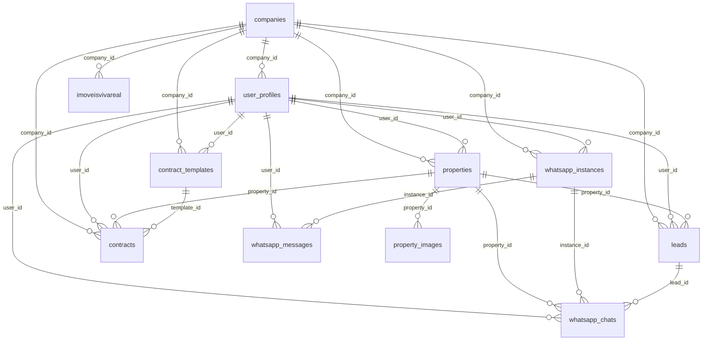

## 2025-08-11

- Adicionado menu `Lei do Inquilinato` com ícone de robô na sidebar (`AppSidebar`) e nova view `InquilinatoView`.
- Atualizado roteamento por `currentView` em `src/pages/Index.tsx` para suportar `inquilinato`.
- Incluída permissão `menu_inquilinato` para todas as roles via migration `supabase/migrations/20250811_add_menu_inquilinato.sql`.
- Atualizado `create_permissions_system.sql` para contemplar a nova permissão (idempotente).

- Adicionado menu `Plantão` na sidebar (`AppSidebar`) com permissão `menu_plantao`.
- Criada `src/components/PlantaoView.tsx` (placeholder inicial) e roteamento em `src/pages/Index.tsx` (case `plantao`).
- Migration `supabase/migrations/20250811165000_add_menu_plantao_permission.sql` para inserir a permissão `menu_plantao` para `corretor`, `gestor` e `admin`.
- Atualizado `create_permissions_system.sql` para incluir `menu_plantao` (idempotente).

- Criada tabela `oncall_schedules` com RLS e índices para armazenar escala por calendário (segunda a domingo).
- Atualizado `docs/schema-db-imobipro.md` com a nova tabela e políticas.

Próximos passos:
- Enriquecer `InquilinatoView` com conteúdo e referências oficiais (busca, filtros, links).
- Ajustar catálogo de eventos caso haja automações relacionadas (n/a por ora).
# ImobiPRO Dashboard — progress_log.md

## Banco de Dados (Supabase) — Inventário e Relações

Este documento descreve o esquema atual do banco de dados no projeto Supabase "imobipro" (região us-east-2), incluindo tabelas, colunas-chave, relacionamentos (PK/FK), índices relevantes, políticas RLS e a hierarquia de acessos aplicada pelas políticas. Mantido como único artefato de rastreio.

### Visão geral de schemas
- auth: tabelas de autenticação gerenciadas pelo Supabase Auth
- public: tabelas funcionais do produto
- storage: objetos/buckets do Storage
- realtime: tabelas internas do Realtime (particionadas por data)
- vault: segredos da extensão Supabase Vault
- extensions/graphql: metadados de extensões

### Tabelas do schema public

1) companies — Empresas/imobiliárias que usam o sistema
- PK: id (uuid)
- Campos: name, cnpj, address, phone, email, logo_url, plan ('basico'|'profissional'|'enterprise'), max_users, is_active, owner_user_id, created_at, updated_at
- FKs: owner_user_id → user_profiles.id
- Índices: companies_pkey
- RLS: habilitado
  - SELECT: "Users can view own company" (permissiva) — exige existir user_profiles.up com up.id = auth.uid() e up.company_id = companies.id
  - ALL: "super_admin_all" — acesso total se user_profiles.role = 'super_admin'

2) user_profiles — Perfis e roles dos usuários do sistema
- PK: id (uuid) (espelha auth.users.id)
- Campos: email, full_name, role ('corretor'|'gestor'|'admin'), company_id, department, phone, avatar_url, is_active, created_at, updated_at
- FKs: id → auth.users.id; company_id → companies.id
- Índices: user_profiles_pkey, idx_user_profiles_role, idx_user_profiles_company_id
- RLS: habilitado
  - INSERT/UPDATE/SELECT: restrito ao próprio registro (id = auth.uid())

3) role_permissions — Permissões granulares por role
- PK: id (uuid)
- Campos: role, permission_key, permission_name, category, description, is_enabled, created_at, updated_at
- Índices: role_permissions_pkey, UNIQUE (role, permission_key)
- RLS: habilitado
  - SELECT: público
  - ALL: "role_permissions_admin_only": permite ALL quando auth.users.raw_user_meta_data->>'role' = 'admin'
  - ALL: "super_admin_all" (via user_profiles.role = 'super_admin')

4) properties — Propriedades/Imóveis
- PK: id (text)
- Campos principais: title, type, price, area, bedrooms, bathrooms, address, city, state, status, description, property_purpose ('Aluguel'|'Venda'), dados proprietários, user_id, company_id, created_at, updated_at
- FKs: user_id → user_profiles.id; company_id → companies.id
- Índices: properties_pkey, idx_properties_user_id, idx_properties_company_id, idx_properties_type, idx_properties_status, idx_properties_city
- RLS: habilitado
  - OWN: policies insert/select/update/delete amarradas a (user_id = auth.uid())
  - SELECT adicional: gestores/admins da mesma company podem ver (via join em user_profiles.company_id)
  - ALL: "super_admin_all"

5) property_images — Imagens das propriedades
- PK: id (uuid)
- Campos: property_id (text), image_url, image_order, created_at
- FKs: property_id → properties.id
- RLS: habilitado
  - SELECT/INSERT/UPDATE/DELETE: permissivas com true (atenção: aberto)

6) leads — Leads/Clientes em potencial
- PK: id (uuid)
- Campos principais: name, email, phone, source, property_id, message, stage, interest, estimated_value, notes, dados pessoais, user_id, company_id, created_at, updated_at
- FKs: user_id → user_profiles.id; property_id → properties.id; company_id → companies.id
- Índices: leads_pkey, idx_leads_user_id, idx_leads_company_id, idx_leads_stage, idx_leads_source
- RLS: habilitado
  - OWN: policies insert/select/update/delete amarradas a (user_id = auth.uid())
  - SELECT adicional: gestores/admins da mesma company podem ver (via join em user_profiles.company_id)
  - ALL: "super_admin_all"

7) contract_templates — Templates de contratos
- PK: id (text)
- Campos: name, description, file_name, file_path, file_size, file_type, template_type ('Locacao'|'Venda'), user_id, company_id, created_by, is_active, timestamps
- FKs: user_id → user_profiles.id; company_id → companies.id
- Índices: contract_templates_pkey
- RLS: habilitado
  - INSERT/SELECT/UPDATE/DELETE: permissivas (true) — aberto a qualquer usuário autenticado
  - ALL: "super_admin_all"

8) contracts — Contratos de locação e venda
- PK: id (text)
- Campos principais: numero (unique), tipo ('Locacao'|'Venda'), status, dados das partes (client_*, landlord_*, guarantor_*), referência do imóvel (property_*), template_*, valor/datas, payment_*, user_id, company_id, created_by, is_active, timestamps
- FKs: user_id → user_profiles.id; company_id → companies.id; property_id → properties.id; template_id → contract_templates.id
- Índices: contracts_pkey, contracts_numero_key, idx_contracts_user_id, idx_contracts_company_id, idx_contracts_property_id, idx_contracts_status
- RLS: habilitado
  - OWN: conjunto de policies ALL/SELECT/INSERT/UPDATE/DELETE amarradas a (user_id = auth.uid())
  - SELECT adicional: gestores/admins da mesma company podem ver
  - ALL: "super_admin_all"

9) whatsapp_instances — Instâncias WhatsApp por usuário
- PK: id (uuid)
- Campos: user_id, company_id, instance_name (unique), phone_number, profile_name, profile_pic_url, status, webhook_url, api_key, last_seen, counters, is_active, timestamps
- FKs: user_id → user_profiles.id; company_id → companies.id
- Índices: whatsapp_instances_pkey, whatsapp_instances_instance_name_key, whatsapp_instances_user_id_instance_name_key, idx_whatsapp_instances_user_id, idx_whatsapp_instances_status
- RLS: habilitado
  - OWN: ALL amarrado a (user_id = auth.uid())
  - SELECT adicional: gestores/admins da mesma company podem ver
  - ALL: "super_admin_all"

10) whatsapp_chats — Conversas WhatsApp
- PK: id (uuid)
- Campos: instance_id, user_id, contact_phone (unique junto com instance_id), contact_name, contact_avatar, last_message, last_message_time, unread_count, is_archived, tags[], lead_id, property_id, timestamps
- FKs: instance_id → whatsapp_instances.id; user_id → user_profiles.id; lead_id → leads.id; property_id → properties.id
- Índices: whatsapp_chats_pkey, whatsapp_chats_instance_id_contact_phone_key, idx_whatsapp_chats_user_id, idx_whatsapp_chats_instance_id
- RLS: habilitado
  - OWN: ALL amarrado a (user_id = auth.uid())
  - SELECT adicional: gestores/admins da mesma company podem ver via associação com whatsapp_instances.company_id
  - ALL: "super_admin_all"

11) whatsapp_messages — Mensagens
- PK: id (uuid)
- Campos: chat_id, instance_id, user_id, message_id, from_me, contact_phone, message_type, content, media_url, caption, timestamp, read_at, delivered_at, created_at
- FKs: chat_id → whatsapp_chats.id; instance_id → whatsapp_instances.id; user_id → user_profiles.id
- Índices: whatsapp_messages_pkey, idx_whatsapp_messages_chat_id, idx_whatsapp_messages_timestamp
- RLS: habilitado
  - OWN: ALL amarrado a (user_id = auth.uid())
  - SELECT adicional: gestores/admins da mesma company via whatsapp_instances.company_id
  - ALL: "super_admin_all"

12) imoveisvivareal — Import de portais
- PK: id (serial)
- Campos: listing_id, imagens[], tipo_categoria, tipo_imovel, descricao, preco, tamanho_m2, quartos, banheiros, ano_construcao, suite, garagem, features[], andar, blocos, cidade, bairro, endereco, numero, complemento, cep, user_id, company_id, timestamps
- FKs: user_id → user_profiles.id; company_id → companies.id
- Índices: imoveis_pkey, idx_imoveisvivareal_user_id, idx_imoveisvivareal_company_id, idx_imoveisvivareal_tipo_imovel, idx_imoveisvivareal_tipo_categoria
- RLS: habilitado
  - OWN: DELETE/INSERT/SELECT/UPDATE amarradas a (user_id = auth.uid())
  - SELECT adicional: gestores/admins da mesma company podem ver
  - ALL: "super_admin_all"

### Storage (storage.objects) — buckets relevantes
- Buckets: 'property-images' e 'contract-templates'
- Políticas em storage.objects:
  - property-images: SELECT/INSERT/UPDATE/DELETE permissivas (qualificador por bucket)
  - contract-templates: SELECT: dono, gestor da mesma empresa ou admin; INSERT: autenticados; UPDATE/DELETE: dono, gestor da mesma empresa ou admin. Usa `public.is_same_company_as(uuid)` (SECURITY DEFINER).

### Hierarquia de papéis e acessos
- corretor: acesso aos próprios registros (OWN) via (user_id = auth.uid()) nas tabelas de domínio
- gestor: além do próprio, acesso de leitura a registros da mesma empresa via checagem de company_id (políticas SELECT adicionais)
- admin: semelhante ao gestor; pode ter permissões extras via role_permissions e policies específicas
- super_admin: bypass de RLS nas tabelas public via policy "super_admin_all"

Observações de segurança
- Existem tabelas com RLS permissiva "true" (ex.: property_images, contract_templates). Avaliar se convém restringir por company_id/user_id conforme maturidade do produto.
- Em todas as tabelas OWN, operações de escrita devem garantir que user_id = auth.uid() em with_check.

### Diagrama de Relacionamentos (Mermaid)

### Extensões instaladas principais
- pgcrypto (uuid), uuid-ossp, pg_graphql, supabase_vault, pg_stat_statements
- PostGIS disponível (não utilizado nas tabelas do domínio)

### RLS (resumo por padrão)
- public: RLS habilitado em todas as tabelas; padrão multi-tenant por company + ownership por user_id
- storage: RLS habilitado em buckets citados com escopo por bucket
- auth/realtime/vault: políticas gerenciadas pelo Supabase (onde aplicável)

---
Última atualização: gerada automaticamente.

## 2025-08-12 — Usuários: criação, hierarquia e senha inicial
- Correção: novos usuários criados via módulo agora recebem `company_id` do criador (Admin), aparecendo imediatamente na lista (RPC `list_company_users`).
- UI: Campo "Departamento" removido do modal de criação e da tabela; "Cargo" renomeado para "Hierarquia"; botão "Cancelar" em vermelho.
- Senha padrão: `VITE_DEFAULT_NEW_USER_PASSWORD` (fallback `Imobi@1234`) usada como senha temporária, exibida no alerta pós-criação.
- Primeiro acesso: adicionadas colunas `require_password_change` e `password_changed_at` em `user_profiles`; modal obrigatório no app força troca de senha (com confirmação) e limpa o flag após sucesso.
- RPCs seguros (gestor): `update_user_role_in_company` (gestor só define `corretor` na própria empresa) e `deactivate_user_in_company` (gestor desativa usuários da própria empresa). Admin mantém poderes globais.

## 2025-08-10 — Endurecimento de RLS e unificação
- Criada migration `supabase/migrations/20250810090000_harden_rls_policies.sql` consolidando políticas RLS por `company_id` + `role` e removendo políticas permissivas/duplicadas.
- Adicionadas funções `get_user_role()` e `get_user_company_id()` (SECURITY DEFINER) e triggers `set_row_tenant_defaults()` para popular `user_id`/`company_id` em inserts.
- Padronizadas políticas em `properties`, `leads`, `contracts`, `contract_templates`, `property_images`, `whatsapp_*`, `companies`, `user_profiles` com `WITH CHECK (company_id = get_user_company_id())` onde aplicável.
- Storage `property-images`: leitura pública, mutações somente autenticadas; mantida segurança mínima sem quebrar MVP.
- Ajustado `src/integrations/supabase/client.ts` para permitir `signInAnonymously()` apenas em DEV quando `VITE_ENABLE_ANON_LOGIN=true`.
- Atualizado `docs/hierarquia-usuarios.md` com matriz de permissões por tabela.

Próximos passos sugeridos:
- Regenerar `src/integrations/supabase/types.ts` após aplicar migrations no projeto Supabase.
- Expandir `verify_access_levels.sql` com asserts para cada role e cenários de falha esperada.
- Backfill concluído: todas as tabelas com `company_id` preenchido. `imoveisvivareal` recebeu `company_id` padrão `f07e1247-b654-4902-939e-dba0f6d0f5a3` para 124 registros legados sem `user_id`.

## 2025-08-10 — Índices de performance
- Criada migration `supabase/migrations/20250810094500_add_performance_indexes.sql` com índices em `company_id`, `user_id`, `created_at` e chaves de junção (`property_id`, `instance_id`, `chat_id`, etc.) nas tabelas de domínio.
- Objetivo: evitar full table scans sob RLS (filtros por empresa/usuário) e melhorar paginação/ordenação.

## 2025-08-11 — Storage contract-templates endurecido
- Criadas policies canônicas para o bucket `contract-templates`: SELECT (dono, gestor da mesma empresa, admin global), INSERT (autenticados), UPDATE/DELETE (dono, gestor da mesma empresa, admin).
- Adicionada função `public.is_same_company_as(uuid)` (SECURITY DEFINER) para checagem de empresa sem recursão de RLS.
- Aplicadas migrations: `20250810102000_harden_contract_templates_storage_policies.sql` e fix `20250810102001_fix_is_same_company_as_cast`.
- Frontend ajustado: upload agora salva em `contract-templates/{userId}/{arquivo}` e cria linha em `contract_templates` com `user_id`/`created_by` preenchidos.

## 2025-08-11 — RLS por role (sem companies) e disponibilidade
- `properties`/`imoveisvivareal`: leitura para autenticados; INSERT para todos; UPDATE/DELETE apenas admin/gestor. Corretores podem alterar somente disponibilidade (gatilhos), exigindo observação quando indisponível/reforma.
- UI: adicionado botão de disponibilidade com select + observação; filtros por disponibilidade; badges de disponibilidade nos cards e detalhes.
- Gate de merge: `verify_access_levels.sql` criado e workflow CI com job `rls-verify` adicionado.
- Tipos TS regenerados via token da Supabase, sem Docker.
- Performance: adicionados índices `idx_imoveisvivareal_created_at` e `idx_properties_created_at`; EXPLAIN sob RLS confirma uso do índice em `imoveisvivareal` (Index Scan + top-N). 
- TODO produção: quando o domínio final estiver definido, configurar CORS/Site URL/Redirect URLs no Supabase com os domínios de produção e atualizar `.env.production` se necessário.

- RLS: criada função `get_current_role()` (SECURITY DEFINER) e aplicadas novas policies por role (sem company_id) em `leads`, `contract_templates` e `whatsapp_*` com FORCE RLS. Índices de suporte criados (`user_id`, `created_at`).

## 2025-08-12 — Conexões (WhatsApp) — permitir gestor vincular a outros usuários
- Criada migration `supabase/migrations/20250812110000_whatsapp_instances_gestor_assign.sql` que:
  - Recria as políticas de `whatsapp_instances` para permitir que **gestores/admins** façam INSERT/UPDATE (incluindo reatribuição de `user_id`) desde que o usuário alvo pertença à **mesma company**.
  - Garante `WITH CHECK` com validação por `company_id` e `EXISTS` em `user_profiles` para o `user_id` destino.
  - Mantém corretores limitados às próprias instâncias.
  - Adiciona índices `idx_whatsapp_instances_company_id` e `idx_whatsapp_instances_user_id` (idempotentes).

## 2025-08-13 — Usuários single-tenant (remover escopo por empresa)
- Atualizada a RPC `public.list_company_users` para modo single-tenant: remove qualquer filtro por `company_id` e retorna todos os registros de `user_profiles`, mantendo filtros opcionais de `search`, `roles` e paginação (`limit_count`, `offset_count`).
- Assinatura da função preservada para compatibilidade do frontend; parâmetro `target_company_id` é ignorado.
- Migration adicionada: `supabase/migrations/20250813130000_list_company_users_remove_company_scope.sql`.

## 2025-01-20 — Melhorias nos gráficos do dashboard
- **Paleta de cores**: Adicionadas cores faltantes (`textPrimary`, `textSecondary`, `secondary`, `tertiary`, `background`) no `chartPalette` para compatibilidade TypeScript.
- **Gauge (Taxa de Ocupação)**: 
  - Redesenho completo do SVG com gradientes profissionais usando as cores do `chartPalette`
  - Corrigido alinhamento vertical com o gráfico VGV através de flexbox e ajustes de altura
  - Eliminados cortes nas bordas ajustando `viewBox` para `300x220` com `overflow-visible`
  - Adicionados efeitos visuais: sombras, gradientes e hover effects
  - Texto central melhorado com tipografia hierárquica
- **Gráfico VGV**: Aplicada solução completa para layout e centralização:
  - Formato ultra compacto sem "R$" (200M, 150M, 100M, 50M) para economizar espaço
  - Gráfico centralizado com flexbox (`justify-center items-center`)
  - Tamanho aumentado: altura de 280px → 320px, container de h-72 → h-80
  - Margens equilibradas: left 80px, right 40px para centralização perfeita
  - `yAxis width: 60` otimizado para máximo espaço do gráfico
  - `tickLabelStyle` otimizado: fontSize 10px, fontWeight 500, fonte Inter
- **Dados dos gráficos organizados**:
  - Criadas views específicas: `vw_chart_leads_por_canal` e `vw_chart_distribuicao_tipo_imovel`
  - Corrigido problema de `company_id` nulo na tabela `imoveisvivareal` usando fallback
  - Atualizado `src/services/metrics.ts` para usar as novas views de dados
  - Melhorado normalizador de tipos (`normalizePropertyType`) para traduzir tipos em inglês:
    - Apartment → Apartamento
    - Home/Sobrado → Casa/Sobrado  
    - Land Lot → Terreno
    - Building → Edifício
    - Industrial → Industrial
    - etc.
- **Erros TypeScript**: Removidas propriedades incompatíveis dos tooltips e legends para eliminar erros de linting
- **UX dos gráficos melhorada**:
  - **Leads por Canal**: Labels do eixo Y agora aparecem completos (sem abreviação), com margem esquerda aumentada para 120px e width do yAxis de 100px
  - **Distribuição por Tipo**: Cores muito mais diferenciadas usando nova paleta `pieChartColors` com 10 cores contrastantes, números incluídos na legenda (ex.: "Apartamento (48)"), espaçamento entre fatias aumentado
- **Reestruturação do layout dos cards**:
  - **Card "Leads por Canal"**: Agora ocupa 2/3 do espaço (col-span-8) e contém dois gráficos lado a lado:
    - **Gráfico por Canal**: Barras horizontais com cores diferenciadas para cada canal (usando `pieChartColors`)
    - **Gráfico Temporal**: Linha com área mostrando evolução de leads nos últimos 6 meses
  - **Card "Distribuição por Tipo"**: Reduzido para 1/3 do espaço (col-span-4) mantendo funcionalidade completa
- **Nova funcionalidade temporal**: 
  - Função `fetchLeadsPorTempo()` busca leads dos últimos 6 meses agrupados por mês
  - Gráfico de área com linha mostra tendência temporal dos leads
  - **Correção de bugs**: Formatação correta de datas usando `monthLabel()`, fallback para dados vazios, margens ajustadas
  - **Eixo Y**: Configurado com `min: 0` para evitar escalas negativas ou vazias
  - **Views criadas**: `vw_chart_leads_temporal` e `vw_segura_leads_temporal` para otimizar consultas temporais
  - **Título atualizado**: Card renomeado de "Leads por canal" para "Conversão de Leads"
  - **Correção de dados**: Função agora detecta automaticamente o range de datas dos leads existentes
  - **Correção crítica**: Import missing de `monthLabel` em `metrics.ts` corrigido - função agora funciona corretamente
  - **Períodos temporais ampliados**: Gráfico "Por Tempo" agora sempre mostra 6 meses completos com dados zerados para meses sem leads
  - **Layout "Por Canal" otimizado**: Margem esquerda reduzida (90→60px) e container sem flexbox centralizador para alinhamento à esquerda
  - **Layout "Por Tempo" otimizado**: Margem esquerda reduzida (50→35px) e container sem flexbox centralizador para alinhamento à esquerda
  - **Alinhamento consistente**: Ambos gráficos agora alinhados à esquerda com seus respectivos títulos

### 📈 **Fase 9 - Padronização Visual Taxa de Ocupação (Janeiro 2025)**
- **Design unificado**: Gráfico "Taxa de ocupação" convertido de gauge SVG customizado para PieChart padrão
- **Consistência visual**: Agora usa o mesmo design do gráfico "Distribuição por tipo"
- **Cores diferenciadas**: Usa `pieChartColors` para melhor distinção visual dos status
- **Legenda com números**: Formato "Status (quantidade)" igual aos outros gráficos de pizza
- **Configuração padrão**: `innerRadius: 60`, `outerRadius: 100`, `paddingAngle: 3`, `cornerRadius: 8`
- **Limpeza de código**: Removidas funções SVG customizadas, imports desnecessários (`Gauge`, `availabilityColors`)
- **Resultado**: Layout otimizado, dados corretos, alinhamento perfeito, visual profissional, dupla visualização de leads e sem erros de compilação