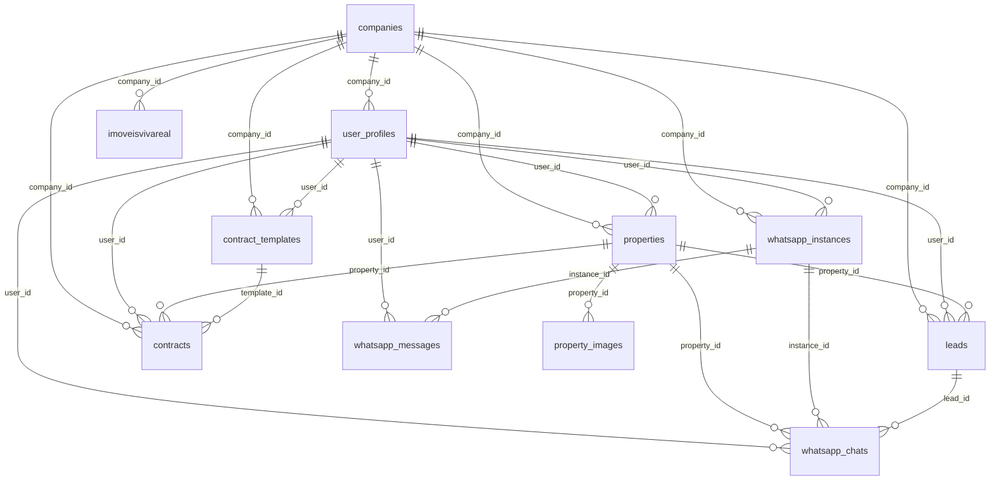

# ImobiPRO Dashboard — progress_log.md

## Banco de Dados (Supabase) — Inventário e Relações

Este documento descreve o esquema atual do banco de dados no projeto Supabase "imobipro" (região us-east-2), incluindo tabelas, colunas-chave, relacionamentos (PK/FK), índices relevantes, políticas RLS e a hierarquia de acessos aplicada pelas políticas. Mantido como único artefato de rastreio.

### Visão geral de schemas
- auth: tabelas de autenticação gerenciadas pelo Supabase Auth
- public: tabelas funcionais do produto
- storage: objetos/buckets do Storage
- realtime: tabelas internas do Realtime (particionadas por data)
- vault: segredos da extensão Supabase Vault
- extensions/graphql: metadados de extensões

### Tabelas do schema public

1) companies — Empresas/imobiliárias que usam o sistema
- PK: id (uuid)
- Campos: name, cnpj, address, phone, email, logo_url, plan ('basico'|'profissional'|'enterprise'), max_users, is_active, owner_user_id, created_at, updated_at
- FKs: owner_user_id → user_profiles.id
- Índices: companies_pkey
- RLS: habilitado
  - SELECT: "Users can view own company" (permissiva) — exige existir user_profiles.up com up.id = auth.uid() e up.company_id = companies.id
  - ALL: "super_admin_all" — acesso total se user_profiles.role = 'super_admin'

2) user_profiles — Perfis e roles dos usuários do sistema
- PK: id (uuid) (espelha auth.users.id)
- Campos: email, full_name, role ('corretor'|'gestor'|'admin'), company_id, department, phone, avatar_url, is_active, created_at, updated_at
- FKs: id → auth.users.id; company_id → companies.id
- Índices: user_profiles_pkey, idx_user_profiles_role, idx_user_profiles_company_id
- RLS: habilitado
  - INSERT/UPDATE/SELECT: restrito ao próprio registro (id = auth.uid())

3) role_permissions — Permissões granulares por role
- PK: id (uuid)
- Campos: role, permission_key, permission_name, category, description, is_enabled, created_at, updated_at
- Índices: role_permissions_pkey, UNIQUE (role, permission_key)
- RLS: habilitado
  - SELECT: público
  - ALL: "role_permissions_admin_only": permite ALL quando auth.users.raw_user_meta_data->>'role' = 'admin'
  - ALL: "super_admin_all" (via user_profiles.role = 'super_admin')

4) properties — Propriedades/Imóveis
- PK: id (text)
- Campos principais: title, type, price, area, bedrooms, bathrooms, address, city, state, status, description, property_purpose ('Aluguel'|'Venda'), dados proprietários, user_id, company_id, created_at, updated_at
- FKs: user_id → user_profiles.id; company_id → companies.id
- Índices: properties_pkey, idx_properties_user_id, idx_properties_company_id, idx_properties_type, idx_properties_status, idx_properties_city
- RLS: habilitado
  - OWN: policies insert/select/update/delete amarradas a (user_id = auth.uid())
  - SELECT adicional: gestores/admins da mesma company podem ver (via join em user_profiles.company_id)
  - ALL: "super_admin_all"

5) property_images — Imagens das propriedades
- PK: id (uuid)
- Campos: property_id (text), image_url, image_order, created_at
- FKs: property_id → properties.id
- RLS: habilitado
  - SELECT/INSERT/UPDATE/DELETE: permissivas com true (atenção: aberto)

6) leads — Leads/Clientes em potencial
- PK: id (uuid)
- Campos principais: name, email, phone, source, property_id, message, stage, interest, estimated_value, notes, dados pessoais, user_id, company_id, created_at, updated_at
- FKs: user_id → user_profiles.id; property_id → properties.id; company_id → companies.id
- Índices: leads_pkey, idx_leads_user_id, idx_leads_company_id, idx_leads_stage, idx_leads_source
- RLS: habilitado
  - OWN: policies insert/select/update/delete amarradas a (user_id = auth.uid())
  - SELECT adicional: gestores/admins da mesma company podem ver (via join em user_profiles.company_id)
  - ALL: "super_admin_all"

7) contract_templates — Templates de contratos
- PK: id (text)
- Campos: name, description, file_name, file_path, file_size, file_type, template_type ('Locacao'|'Venda'), user_id, company_id, created_by, is_active, timestamps
- FKs: user_id → user_profiles.id; company_id → companies.id
- Índices: contract_templates_pkey
- RLS: habilitado
  - INSERT/SELECT/UPDATE/DELETE: permissivas (true) — aberto a qualquer usuário autenticado
  - ALL: "super_admin_all"

8) contracts — Contratos de locação e venda
- PK: id (text)
- Campos principais: numero (unique), tipo ('Locacao'|'Venda'), status, dados das partes (client_*, landlord_*, guarantor_*), referência do imóvel (property_*), template_*, valor/datas, payment_*, user_id, company_id, created_by, is_active, timestamps
- FKs: user_id → user_profiles.id; company_id → companies.id; property_id → properties.id; template_id → contract_templates.id
- Índices: contracts_pkey, contracts_numero_key, idx_contracts_user_id, idx_contracts_company_id, idx_contracts_property_id, idx_contracts_status
- RLS: habilitado
  - OWN: conjunto de policies ALL/SELECT/INSERT/UPDATE/DELETE amarradas a (user_id = auth.uid())
  - SELECT adicional: gestores/admins da mesma company podem ver
  - ALL: "super_admin_all"

9) whatsapp_instances — Instâncias WhatsApp por usuário
- PK: id (uuid)
- Campos: user_id, company_id, instance_name (unique), phone_number, profile_name, profile_pic_url, status, webhook_url, api_key, last_seen, counters, is_active, timestamps
- FKs: user_id → user_profiles.id; company_id → companies.id
- Índices: whatsapp_instances_pkey, whatsapp_instances_instance_name_key, whatsapp_instances_user_id_instance_name_key, idx_whatsapp_instances_user_id, idx_whatsapp_instances_status
- RLS: habilitado
  - OWN: ALL amarrado a (user_id = auth.uid())
  - SELECT adicional: gestores/admins da mesma company podem ver
  - ALL: "super_admin_all"

10) whatsapp_chats — Conversas WhatsApp
- PK: id (uuid)
- Campos: instance_id, user_id, contact_phone (unique junto com instance_id), contact_name, contact_avatar, last_message, last_message_time, unread_count, is_archived, tags[], lead_id, property_id, timestamps
- FKs: instance_id → whatsapp_instances.id; user_id → user_profiles.id; lead_id → leads.id; property_id → properties.id
- Índices: whatsapp_chats_pkey, whatsapp_chats_instance_id_contact_phone_key, idx_whatsapp_chats_user_id, idx_whatsapp_chats_instance_id
- RLS: habilitado
  - OWN: ALL amarrado a (user_id = auth.uid())
  - SELECT adicional: gestores/admins da mesma company podem ver via associação com whatsapp_instances.company_id
  - ALL: "super_admin_all"

11) whatsapp_messages — Mensagens
- PK: id (uuid)
- Campos: chat_id, instance_id, user_id, message_id, from_me, contact_phone, message_type, content, media_url, caption, timestamp, read_at, delivered_at, created_at
- FKs: chat_id → whatsapp_chats.id; instance_id → whatsapp_instances.id; user_id → user_profiles.id
- Índices: whatsapp_messages_pkey, idx_whatsapp_messages_chat_id, idx_whatsapp_messages_timestamp
- RLS: habilitado
  - OWN: ALL amarrado a (user_id = auth.uid())
  - SELECT adicional: gestores/admins da mesma company via whatsapp_instances.company_id
  - ALL: "super_admin_all"

12) imoveisvivareal — Import de portais
- PK: id (serial)
- Campos: listing_id, imagens[], tipo_categoria, tipo_imovel, descricao, preco, tamanho_m2, quartos, banheiros, ano_construcao, suite, garagem, features[], andar, blocos, cidade, bairro, endereco, numero, complemento, cep, user_id, company_id, timestamps
- FKs: user_id → user_profiles.id; company_id → companies.id
- Índices: imoveis_pkey, idx_imoveisvivareal_user_id, idx_imoveisvivareal_company_id, idx_imoveisvivareal_tipo_imovel, idx_imoveisvivareal_tipo_categoria
- RLS: habilitado
  - OWN: DELETE/INSERT/SELECT/UPDATE amarradas a (user_id = auth.uid())
  - SELECT adicional: gestores/admins da mesma company podem ver
  - ALL: "super_admin_all"

### Storage (storage.objects) — buckets relevantes
- Buckets: 'property-images' e 'contract-templates'
- Políticas em storage.objects:
  - property-images: SELECT/INSERT/UPDATE/DELETE permissivas (qualificador por bucket)
  - contract-templates: SELECT/INSERT/UPDATE/DELETE para usuários autenticados (auth.role()='authenticated')

### Hierarquia de papéis e acessos
- corretor: acesso aos próprios registros (OWN) via (user_id = auth.uid()) nas tabelas de domínio
- gestor: além do próprio, acesso de leitura a registros da mesma empresa via checagem de company_id (políticas SELECT adicionais)
- admin: semelhante ao gestor; pode ter permissões extras via role_permissions e policies específicas
- super_admin: bypass de RLS nas tabelas public via policy "super_admin_all"

Observações de segurança
- Existem tabelas com RLS permissiva "true" (ex.: property_images, contract_templates). Avaliar se convém restringir por company_id/user_id conforme maturidade do produto.
- Em todas as tabelas OWN, operações de escrita devem garantir que user_id = auth.uid() em with_check.

### Diagrama de Relacionamentos (Mermaid)

### Extensões instaladas principais
- pgcrypto (uuid), uuid-ossp, pg_graphql, supabase_vault, pg_stat_statements
- PostGIS disponível (não utilizado nas tabelas do domínio)

### RLS (resumo por padrão)
- public: RLS habilitado em todas as tabelas; padrão multi-tenant por company + ownership por user_id
- storage: RLS habilitado em buckets citados com escopo por bucket
- auth/realtime/vault: políticas gerenciadas pelo Supabase (onde aplicável)

---
Última atualização: gerada automaticamente.
