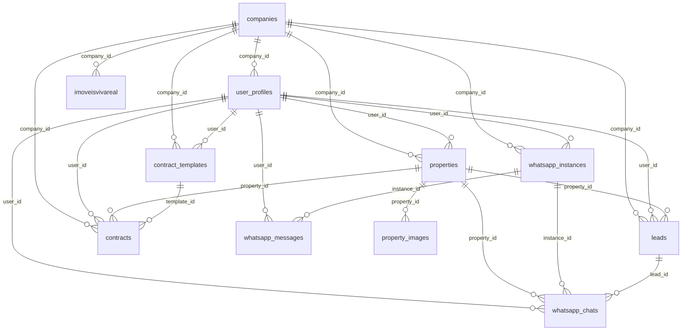

# ImobiPRO — Esquema de Banco de Dados (Supabase)

Este documento descreve o esquema atual do banco de dados do projeto imobiproREAL no Supabase, incluindo tabelas, relacionamentos (PK/FK), políticas de segurança (RLS) e a hierarquia de papéis e acessos.

## Visão Geral de Schemas
- auth: autenticação do Supabase (gerenciado pela plataforma)
- public: domínio de negócio do ImobiPRO
- storage: objetos e buckets do Storage
- realtime: tabelas internas do Realtime (particionado por data)
- vault: segredos gerenciados via extensão Supabase Vault

## Tabelas do Schema public

### companies — Empresas
- PK: id (uuid)
- Campos: name, cnpj, address, phone, email, logo_url, plan (default 'basico'), max_users (default 5), is_active (default true), created_at, updated_at
- RLS: habilitado
  - SELECT: somente se existir `user_profiles` com `id = auth.uid()` e `company_id = companies.id`

### user_profiles — Perfis de Usuário
- PK: id (uuid) — espelha `auth.users.id`
- Campos: email, full_name, role (default 'corretor'), company_id, department, phone, avatar_url, is_active (default true), created_at, updated_at
- FKs: company_id → companies.id
- RLS: habilitado
  - SELECT/UPDATE: `id = auth.uid()`

### role_permissions — Permissões por Papel
- PK: id (uuid)
- Campos: role, permission_key, permission_name, category, description, is_enabled (default false), created_at, updated_at
- RLS: habilitado
  - SELECT: por role do usuário
  - ALL: somente admin (policy específica)

### properties — Imóveis
- PK: id (text)
- Campos: title, type, price, area, bedrooms, bathrooms, address, city, state, status (default 'available'), description, property_purpose (default 'Aluguel'), dados de proprietário, user_id, company_id, created_at, updated_at
- FKs: user_id → user_profiles.id; company_id → companies.id
- RLS: habilitado
  - OWN: ALL onde `user_id = auth.uid()`
  - SELECT adicional: `gestor`/`admin` da mesma empresa via `user_profiles.company_id`

### property_images — Imagens de Imóveis
- PK: id (uuid)
- Campos: property_id (text), image_url, image_order (default 0), created_at
- FKs: property_id → properties.id
- RLS: habilitado
  - SELECT/INSERT/UPDATE/DELETE: permissivas (true) — aberto

### leads — Leads
- PK: id (uuid)
- Campos: name, email, phone, source, property_id, message, stage (default 'Novo Lead'), interest, estimated_value (default 0), notes, cpf, endereco, estado_civil, imovel_interesse, user_id, company_id, created_at, updated_at
- FKs: user_id → user_profiles.id; company_id → companies.id; property_id → properties.id
- RLS: habilitado
  - OWN: ALL onde `user_id = auth.uid()`
  - SELECT adicional: `gestor`/`admin` da mesma empresa via `user_profiles.company_id`

### contract_templates — Templates de Contrato
- PK: id (text)
- Campos: name, description, file_name, file_path, file_size, file_type, template_type (default 'Locacao'), user_id, company_id, created_by, is_active (default true), created_at, updated_at
- FKs: user_id → user_profiles.id; company_id → companies.id
- RLS: habilitado
  - SELECT/INSERT/UPDATE/DELETE: permissivas (true) — aberto a usuários autenticados

### contracts — Contratos
- PK: id (text)
- Campos: numero, tipo, status (default 'Pendente'), dados do cliente/locador/fiador, property_*, template_*, valor, datas (data_inicio, data_fim, etc.), payment_*, user_id, company_id, created_by, is_active (default true), created_at, updated_at
- FKs: user_id → user_profiles.id; company_id → companies.id; property_id → properties.id; template_id → contract_templates.id
- RLS: habilitado
  - OWN: ALL onde `user_id = auth.uid()`
  - SELECT adicional: `gestor`/`admin` da mesma empresa via `user_profiles.company_id`

### whatsapp_instances — Instâncias do WhatsApp
- PK: id (uuid)
- Campos: user_id, company_id, instance_name, phone_number, profile_name, profile_pic_url, status (default 'disconnected'), webhook_url, api_key, last_seen, message_count, contact_count, chat_count, is_active (default true), created_at, updated_at
- FKs: user_id → user_profiles.id; company_id → companies.id
- RLS: habilitado
  - OWN: ALL onde `user_id = auth.uid()`
  - SELECT adicional: `gestor`/`admin` da mesma empresa

### whatsapp_chats — Conversas
- PK: id (uuid)
- Campos: instance_id, user_id, contact_phone, contact_name, contact_avatar, last_message, last_message_time, unread_count (default 0), is_archived (default false), tags[], lead_id, property_id, created_at, updated_at
- FKs: instance_id → whatsapp_instances.id; user_id → user_profiles.id; lead_id → leads.id; property_id → properties.id
- RLS: habilitado
  - OWN: ALL onde `user_id = auth.uid()`
  - SELECT adicional: `gestor`/`admin` da mesma empresa

### whatsapp_messages — Mensagens
- PK: id (uuid)
- Campos: chat_id, instance_id, user_id, message_id, from_me, contact_phone, message_type, content, media_url, caption, timestamp, read_at, delivered_at, created_at
- FKs: chat_id → whatsapp_chats.id; instance_id → whatsapp_instances.id; user_id → user_profiles.id
- RLS: habilitado
  - OWN: ALL onde `user_id = auth.uid()`
  - SELECT adicional: `gestor`/`admin` da mesma empresa

### imoveisvivareal — Import de Portais
- PK: id (serial)
- Campos: listing_id, imagens[], tipo_categoria, tipo_imovel, descricao, preco, tamanho_m2, quartos, banheiros, ano_construcao, suite, garagem, features[], andar, blocos, cidade, bairro, endereco, numero, complemento, cep, user_id, company_id, created_at, updated_at
- FKs: user_id → user_profiles.id; company_id → companies.id
- RLS: desabilitado atualmente

## Storage — Buckets e Políticas
- Buckets usados: 'property-images', 'contract-templates'
- Policies em storage.objects:
  - property-images: SELECT/INSERT/UPDATE/DELETE liberadas por bucket
  - contract-templates: operações permitidas para `auth.role()='authenticated'`

## Hierarquia de Papéis
- corretor: acesso OWN (user_id = auth.uid())
- gestor: leitura estendida por `company_id` nas tabelas de domínio
- admin: similar ao gestor, com gestão de permissões via `role_permissions`

## Diagrama ER (Mermaid)

## Notas e Recomendações
- Reavaliar policies permissivas (true) em `property_images` e `contract_templates` conforme maturidade.
- Garantir `WITH CHECK (user_id = auth.uid())` nas tabelas OWN para escrita.
- Ativar RLS em `imoveisvivareal` quando necessário e alinhar com padrão multi-tenant.
